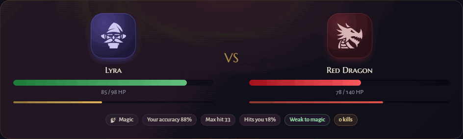
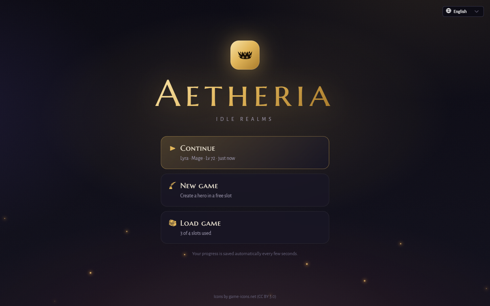
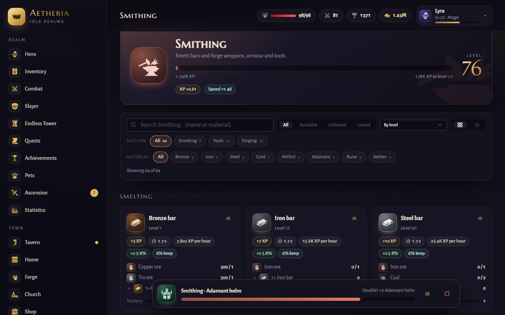
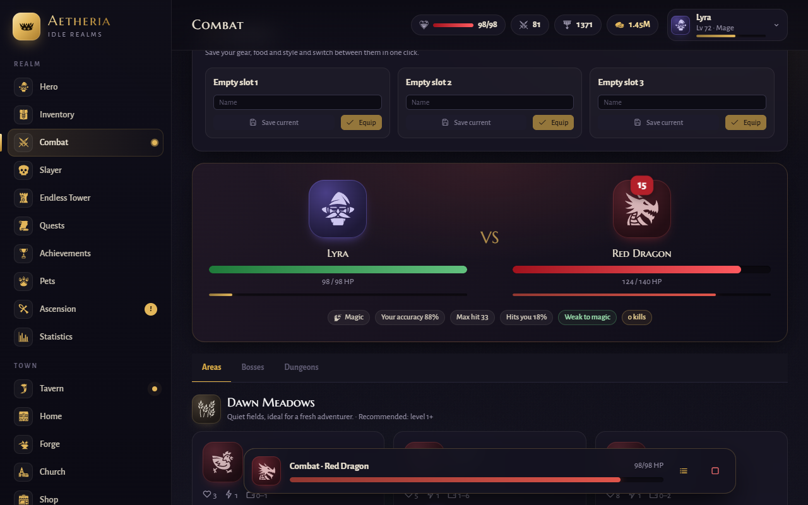
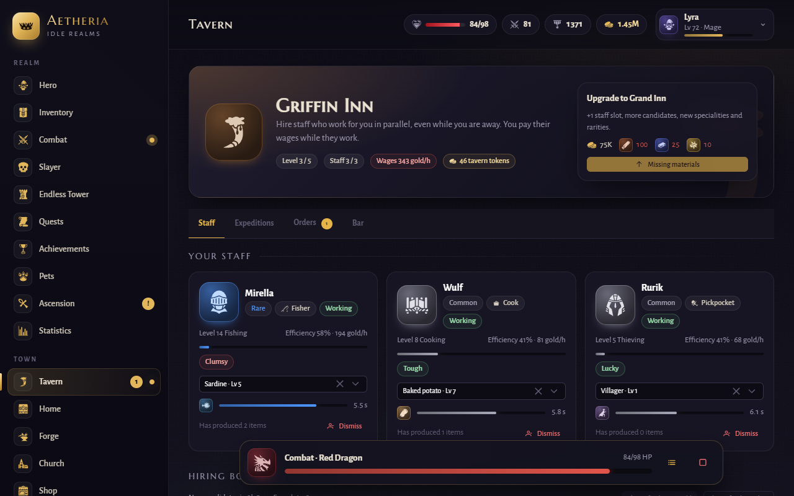
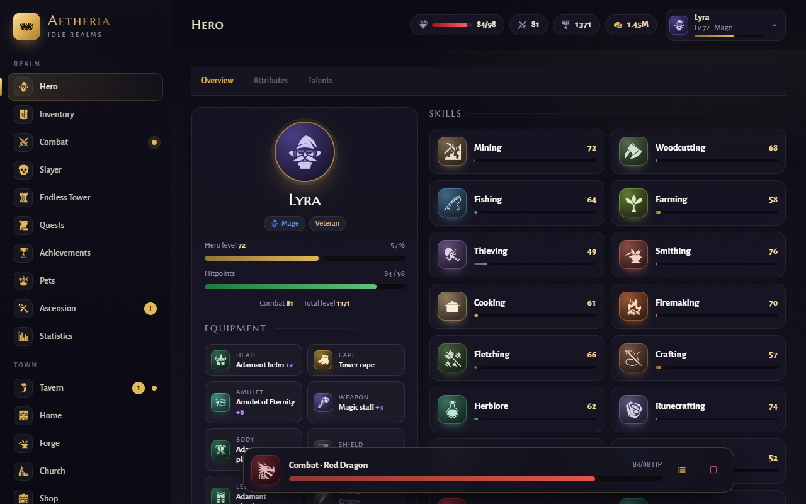
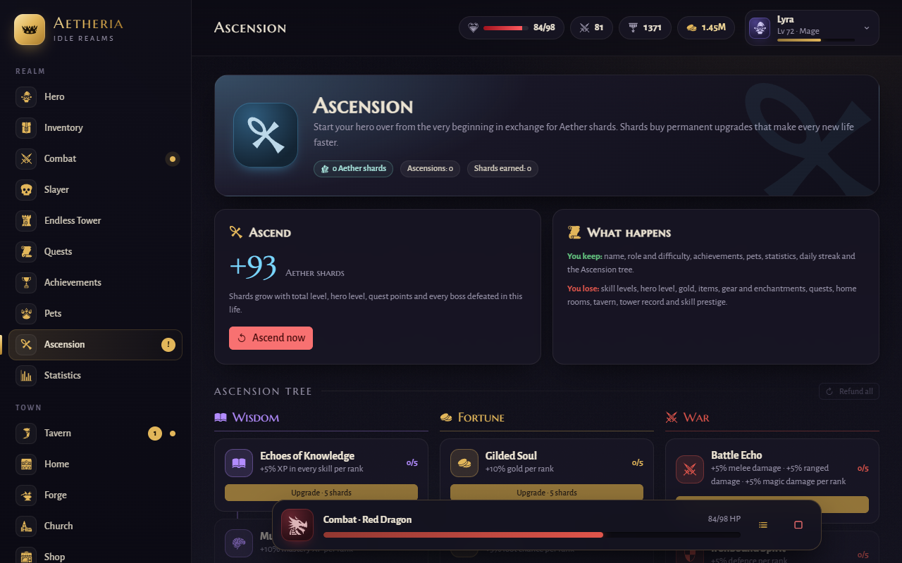

# Aetheria

[](https://github.com/Heavenly3/Aetheria/actions/workflows/ci.yml)


A fantasy idle RPG for the browser. Built with Vue 3, PrimeVue 4 and Vite.

<p>
  <a href="https://heavenly3.github.io/Aetheria/"></a>
  <a href="https://3vynia.itch.io/aetheria"></a>
</p>

No download needed. It can also be installed as an app (the install button in the address bar, or "Add to Home Screen" on mobile) and keeps working offline.



Available in **English** and **Spanish** (switch from the title screen or Settings).

## Screenshots

<table>
  <tr>
    <td></td>
    <td></td>
  </tr>
  <tr>
    <td></td>
    <td></td>
  </tr>
  <tr>
    <td></td>
    <td></td>
  </tr>
</table>

## Getting started

```bash
npm install
npm run dev            # dev server at http://localhost:5173
npm run build          # production build in dist/
npm test               # engine tests (Vitest)
npm run build:single   # one self-contained HTML file in dist-single/
npm run icons          # regenerate src/game/icons.json and validate icon names
npm run check:i18n     # make sure every language has every key
npm run balance        # XP/hour, gold/hour and combat estimates for every level
```

Requires Node.js 18 or newer.

## Features

- **Title screen** with Continue, New game and Load. Four save slots, each saved automatically every 10 seconds, when the tab is hidden and on close.
- **Character creation**: name, portrait and colour, one of 6 roles (Warrior, Ranger, Mage, Artisan, Rogue, Paladin) and one of 4 difficulties.
- **21 skills** across gathering, artisan, support and combat, with per-action mastery and prestige.
- **Hero level (1–100)** fed by 25% of all skill XP. Every level grants attribute points (STR, DEX, INT, VIT, WIS, LCK) and every 2 levels a talent point. Every stat can be raised: Dexterity speeds up attacks and adds crits, Vitality adds damage reduction, Luck adds crits, elites and finer fish, and talents cover block, crits, attack speed, armour, elites, fishing luck and craft quality. The combat power panel shows where every number comes from.
- **Tools**: tiered pickaxes, axes and fishing rods gate advanced resources; a sickle makes crops grow faster and yield more, and lockpicks make thieving faster and safer.
- **Thieving**: every theft raises the guard's heat, which makes thefts fail more often; getting caught on alert means jail (bribe your way out, or pay an informant to cool things down). Valuables lifted now and then sell best at the fence while the streets are calm, and four heists (from a merchant's vault to the royal treasury) play out in stages (plan, slip in, crack, get away) for gold, loot and the shadow outfit.
- **Fishing waters**: five waters from the Dawn River to the Abyssal Trench, each with its own fish. Every cast lands a fish at random from the water's table; bait (worms, feather flies, glowing lures), mastery of the water and luck make the finer fish likelier. A fishing scene shows the line, the bobber and the latest catches.
- **Gathering finds**: geodes while mining, caskets while fishing, bird nests while woodcutting and seed pouches while harvesting. Mining has a gem rock, fishing reaches tuna and anglerfish, and thieving has stalls that pay in goods instead of coins.
- **Crafting quality**: every piece of gear made at the anvil, the fletching bench or the crafting table can come out Fine (+5% stats), Superior (+10%) or Masterwork (+20%). The chances grow with your mastery of the recipe, so mastering a recipe pays off. Mage robes are woven from flax in four cloths (linen, silk, spellweave, starweave) and ranger hides are stitched from wolf pelts, snake skins and wyvern scales, each with its own set bonus.
- **Farming**: plots grow in real time, even offline, with optional auto-replant.
  - Compost and supercompost raise the harvest; halfway through, a plot can turn bountiful (double harvest) or catch pests to shoo away (a scarecrow keeps them off).
  - Every crop has a favourite season that yields 25% more.
  - **Hybrids**: two parent crops growing side by side can cross into seeds of a crop found nowhere else (moonroot, emberbloom, sunberry, starpetal), recorded in an almanac.
  - **Farmyard**: a chicken coop and a beehive that produce eggs, feathers and honey on their own, a scarecrow and a well.
- **Combat**: 10 areas, 7 bosses with mercenaries, 6 multi-room dungeons, an endless tower, slayer tasks, prayers and loadouts.
  - **Endless tower**: from floor 6, every block of five floors has a weekly twist (regenerating, armoured, venomous, vampiric, frenzied, elusive, swift or brutal creatures) that pays more tokens. Named guardians on every tenth floor pay a reward on their first defeat, and the best climbers of the realm's guilds race the hero to the top.
  - **Slayer**: pick one of three hunts (easy, standard or hard) that pay points, gold and Slayer XP. While a creature is your task, a tougher Superior version can step up and drop slayer sigils, used to imbue the slayer helm. Points buy permanent perks (longer hunts, bounties, Superior tracking, insight), blocked creatures and supplies, and long streaks pay gem chests.
  - Every weapon has its own attack speed, crit chance and sometimes a status it leaves: bleeding, burns, poison, stuns, slows or weakness. Agility dodges, shields block and armour soaks part of every blow.
  - **Abilities**: six per style (melee, ranged, magic), unlocked by level. Attacks build energy, and up to three abilities on the bar fire on their own in priority order.
  - Creatures have traits (venom, armour, regeneration, life drain, frenzy, evasion), rare elites spawn with much better loot, and bosses turn enraged and then desperate as their health drops.
  - **Hunting streaks** of kills without dying add up to +25% combat XP and loot.
  - A **combat power** panel shows damage per second, defence and more, gear comparisons and item tooltips show what a piece really changes, monster cards show the time per kill, and the arena shows live damage, kill, XP and gold rates.
- **Endgame beyond the Abyss**: the Void Rift and the Celestial Spire, aether gear forged at level 90 and boss-only uniques.
- **Pets**: 34 very rare companions from skilling, bosses, slayer tasks, dice, omens and festivals. A lucky find arrives as an egg that hatches in the incubator. Pick one as your companion, name it, feed it its favourite food (ores for the golem, fish for the heron…) and pet it: it learns alongside you up to level 20, grows its bond from Wary to Soulbound, doubles its bonus while fed and brings gifts to a basket. Hunger, hatching and gifts follow the clock, so they keep going offline.
- **Enchanting**: raise each equipment slot from +1 to +10. Higher levels can fail and drop a level unless protected with a starlight shard.
- **Relic forge**: work omen relics at the anvil. Reforge one to roll its quality again with the exact odds shown first (a starlight shard seals it so it cannot drop), and every roll that does not improve it heats the forge for better odds next time. Fuse three relics of a quality into one of the next, of the kind you choose, or reshape a relic into another kind. Worn relics are reforged in place.
- **In-game help**: every screen has a "?" next to its title that explains what it is for and how to use it, and the main sections, settings and numbers carry their own "?" hints. Hovering any item shows its full card (stats, effects, requirements, set, value and drop chance). On touch screens the hints open with a tap.
- **Church and the Order of the Dawn**: blessings bought with gold, a daily offering for Brother {priest} that earns favour (longer blessings, an extra slot, cheaper blessings), holy water brewed with Herblore that renews every active blessing, and an altar where bones give three times the Prayer XP. Twelve combat prayers, from Stone Skin to Augury.
- **Agility**: courses pay marks of grace (and now coin pouches and nests), spent on permanent speed and on the four-piece graceful outfit. Agility also makes thieving safer and helps dodge blows.
- **Daily and weekly tasks** with a day streak that boosts rewards.
- **Equipment sets**: 13 sets (every metal, leather, dragonhide, wizard, slayer, dragonbane and the endgame regalia) with bonuses for 2, 3, 4 or 5 pieces worn.
- **Compendium**: three books in one. Creatures: every creature you defeat is recorded; learn its drops, master it for a combat bonus against it and complete each area for a permanent reward. Items: every item you have ever held, on twenty pages that each pay a permanent bonus when full. Masterworks: the best quality you have crafted of every piece of gear, with milestones for distinct masterworks.
- **Omens**: twelve rare world phenomena that arrive unannounced, from the common Starfall to the mythic Eye that Opens. Each omen announces itself with its own cryptic sign, which also marks it in the chronicle until you witness it; then a Blood Moon, an Arcane Eclipse, a Gilded Goblin to chase, a Wandering Rift with a horror that scales with you, a Veiled Caravan, a Comet of Wishes… They hide rewards found nowhere else: seven pets, relics of random quality, permanent wishes and boons rolled when an omen ends. A chronicle records the ones you have witnessed; the rest stay a mystery.
- **Weekly boss**: from combat level 30, a different boss every week (the same one for every player, picked by a seeded rotation). Six bosses, each resisting one style, weak to another and with its own mechanic: stone skin, regrowth, thralls, fire breath, reflecting scales or rime that slows you. Its health lasts all week, attempts last up to five minutes while its fury grows, and falling costs no gold. Damage milestones pay gold, chests, starlight shards and relics, and the first kill of each boss drops its exclusive trophy.
- **Weather**: the sky changes every three hours, the same for every player: clear days and starry nights, overcast, rain, fog, wind and snow, plus rarer climate events (thunderstorms, heatwaves and blizzards) that follow the real seasons. Every weather, season and the night change modifiers (rain helps fishing and farming, fog helps thieving, storms boost magic but make monsters stronger…), listed in the top bar tooltip, and each change is announced.
- **Journal and story**: the story of Aetheria told in chapters that unlock as you explore, beat bosses and witness omens, with the people you meet (a new cast of names in every game) and a memory of a past life with each ascension. The tavern keeper comments on the story, the astrologer leaves notes on omens and studied creatures reveal their lore.
- **Music and ambience**: generative music made with WebAudio that follows where you are and the time of day, and weather sounds (rain, wind, thunder, birds, crickets), with their own volumes in Settings. No audio files.
- **Guilds**: every new world founds twelve guilds with their own name, crest, motto, guildmaster, members, tier (1–5) and focus: one role, a few roles, or open to all. Meet a guild's requirements, pay its fee and pass the entry trial (a task plus a riddle, a rune sequence or a code lock) to join. Members take contracts that renew every four hours for guild marks, gold and reputation, climb six ranks, earn a perk that grows with rank and tier, and spend marks in the guild shop. A ranking orders the guilds by renown, which grows every day and with the hero's work.
- **Titles and appearance**: 38 titles shown next to the hero's name, plus extra portraits and colours unlocked by achievements and festivals.
- **Ascension**: start the whole hero over for Aether shards and spend them in a three-branch tree of permanent upgrades.
- **Tavern**: hire staff (11 specialities, 4 rarities, traits and levels) who work in parallel for a wage. Includes 1/4/8 h expeditions, daily orders, drinks, dice and a mystery chest.
  - **The bar**: patrons drop in over time, even offline, asking for food and drink from your stores; serving them pays gold and tips and raises the tavern's reputation. Special guests (the Faceless Merchant, a bard, a royal courier, a weary knight) ask for more and pay with rare goods.
  - **Brews**: amber ale, herbal mead, strawberry wine and fire grog, brewed with Cooking and drunk instead of buying the drink.
  - **Treasure maps** found while thieving open an expedition of their own.
- **Action queue** that moves on to the next task by itself, and **chained crafting**: when a recipe runs out, the game makes the missing materials first (mine, smelt, then forge) and goes back to it.
- **Guided tutorial** for new heroes: thirteen short steps over the first ten minutes (mine, smelt, fight, meet the tavern, open the journal) and a short tour of the guilds, the farm and the compendium, with the next button highlighted. It can be hidden, skipped or restarted from Settings.
- **Light and dark themes**, or follow the device setting.
- **Phone friendly**: a bottom navigation bar, larger touch targets and a layout that fits narrow screens.
- **Backup and transfer**: download the save as a file, load it again anywhere, or send yourself a transfer link that opens the hero on another device. No account or server involved.
- **Quality of life**: search and filters on every skill, item locking, bulk selling, a daily market, charts, browser notifications, update notes in Settings with a What's new window, and options for fewer pop-ups, full numbers and reduced animations.
- **Offline progress** up to a cap that grows as you play.

## Project layout

- `src/game/data/`: all game content (skills, items, actions, monsters, quests, achievements, home, tavern). Balance and new content live here.
- `src/game/engine.js`: reactive state and core logic (XP, actions, combat, quests, prestige, offline simulation).
- `src/game/systems.js`: tavern, staff, expeditions, orders, queue, loadouts, prayers, market, events and history.
- `src/game/meta.js`: pet rolls, gear enchanting and daily / weekly tasks.
- `src/game/companions.js`: eggs, the companion, feeding, bond, pet levels and gifts (tuning in `src/game/data/companions.js`).
- `src/game/relicforge.js`: reforging, fusing and reshaping relics (costs and odds in `src/game/data/relicforge.js`).
- `src/game/weekly.js`: the weekly boss, its mechanics and milestones (bosses and tuning in `src/game/data/weekly.js`).
- `src/game/ascension.js`: ascension (rebirth) and its upgrade tree.
- `src/game/slayer.js`: slayer tasks and offers, Superior creatures, perks and blocked creatures (tuning in `src/game/data/slayer.js`).
- `src/game/thief.js`: heat, jail, the fence and heists (tuning in `src/game/data/thieving.js`).
- `src/game/farm.js`: soil, plot events, hybrids, farm buildings and favourite seasons (tuning in `src/game/data/farm.js`).
- `src/game/bar.js`: patrons, special guests and the hero's own brews (tuning in `src/game/data/bar.js`).
- `src/game/church.js`: the Order's favour, daily offerings, holy water and the graceful outfit (tuning in `src/game/data/church.js`).
- `src/game/codex.js`: the compendium's item pages and masterwork milestones (pages and rewards in `src/game/data/codex.js`).
- `src/game/collection.js`: equipment set bonuses, the bestiary, cosmetics and festivals.
- `src/game/omens.js`: omens, their creatures, relics, wishes and boons.
- `src/game/fighting.js`: weapon pace, crits, statuses, creature traits, elites, abilities, boss phases, streaks and the combat power numbers (tuning in `src/game/data/fighting.js`).
- `src/game/guilds.js`: founding the guilds, applications, the entry trial and its puzzles, contracts, ranks, perks and the guild shop (tuning in `src/game/data/guilds.js`).
- `src/game/journal.js`: the story journal, its chapters and memories (texts in the locales, chapters and characters in `src/game/data/journal.js`).
- `src/game/music.js`: generative music and weather ambience.
- `src/game/loop.js`: game loop, offline progress and autosave.
- `src/game/tutorial.js`: the guided first steps.
- `src/game/transfer.js`: save files and transfer links (the save is deflated and base64url-encoded into the link).
- `src/i18n/`: vue-i18n setup and the `en` / `es` message files. Game data only stores ids; names are looked up at render time, so the journal and notifications follow the selected language.
- `src/components/` and `src/views/`: the UI.
- `public/`: app manifest, service worker (offline play) and icons.
- `scripts/`: icon extraction, the translation checker and the balance report.
- `tests/`: Vitest suites for levels, actions, chained crafting, combat, saves, save transfer, the tutorial, sets, the bestiary, festivals, omens, the weekly boss, the relic forge, cosmetics, pets, enchanting, daily tasks, ascension, combat mechanics and abilities, weather effects, guilds, the journal, music moods, update notes and translations.

## Adding a language

1. Copy `src/i18n/locales/en.js` to a new file (for example `fr.js`) and translate the values. Keep every `{placeholder}` as it is.
2. Register it in `LOCALES` and `messages` in `src/i18n/index.js`.
3. Run `npm run check:i18n`.

## Credits

- Icons from [game-icons.net](https://game-icons.net) by Lorc, Delapouite and contributors, licensed under [CC BY 3.0](https://creativecommons.org/licenses/by/3.0/).

## License

[MIT](LICENSE)
